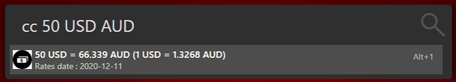

# Currency Converter (Flow.Launcher.Plugin.Currency)

Currency conversion for the [Flow Launcher](https://github.com/Flow-Launcher/Flow.Launcher)

### About

Uses the [European Central Bank](https://www.ecb.europa.eu/stats/policy_and_exchange_rates/euro_reference_exchange_rates/html/index.en.html) daily rates to get and convert currency exchange rates.

Currency code that can be used are:

'AUD' , 'BGN' , 'BRL' , 'CAD' , 'CHF' , 'CNY' , 'CZK' , 'DKK' , 'GBP', 'HKD' , 'HRK' , 'HUF' , 'IDR' , 'ILS' , 'INR' , 'ISK' , 'JPY' , 'KRW', 'MXN', 'MYR' , 'NOK' , 'NZD' , 'PHP' , 'PLN' , 'RON' , 'RUB' , 'SEK', 'SGD' , 'THB' , 'TRY' , 'USD' , 'ZAR' , 'EUR'

### Requirements

Flow Launcher should take care of the installation of Python for you if it is not on your system, as well as the libraries needed by this plugin.

You must be online when you run the plugin in Flow to download the currency XML file, or you will get a connection error. A local copy of the local XML file froma previous download can be used if it exists.

### Plugin Settings

Type `settings` in Flow to access the settings window, then go to Plugins - Currency Converter

__Keyword (default 'cc')__ - change this to set a new keyword to activate the plugin

__File age (default 6)__ - the age in hours for the local copy of the rates file to be used before the plugin downloads a fresh copy

### Installing

#### Package Manager

Use the `pm install` command from within Flow itself.

### Localisation

Currently English and Chinese language supported. Edit the .env file to change the language.

### Usage

| Keyword                                                          | Description                                 |
| ---------------------------------------------------------------- | ------------------------------------------- |
| `cc {amount} {source currency code} {destination currency code}` | Convert amount from source to dest currency |

When typing the source or destination currency the plugin will show what currencies are available.

Decimal precision is based on the input amount however the base rate is always a minimum of three decimal places.

### Problems, errors and feature requests

Open an issue in this repo.
